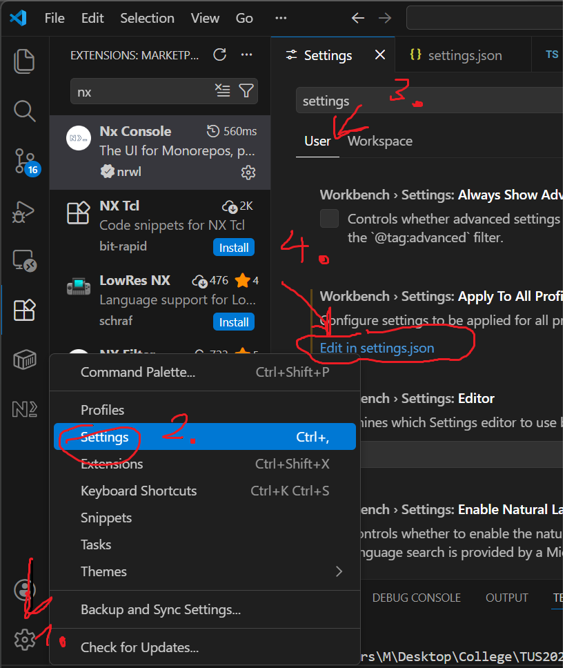
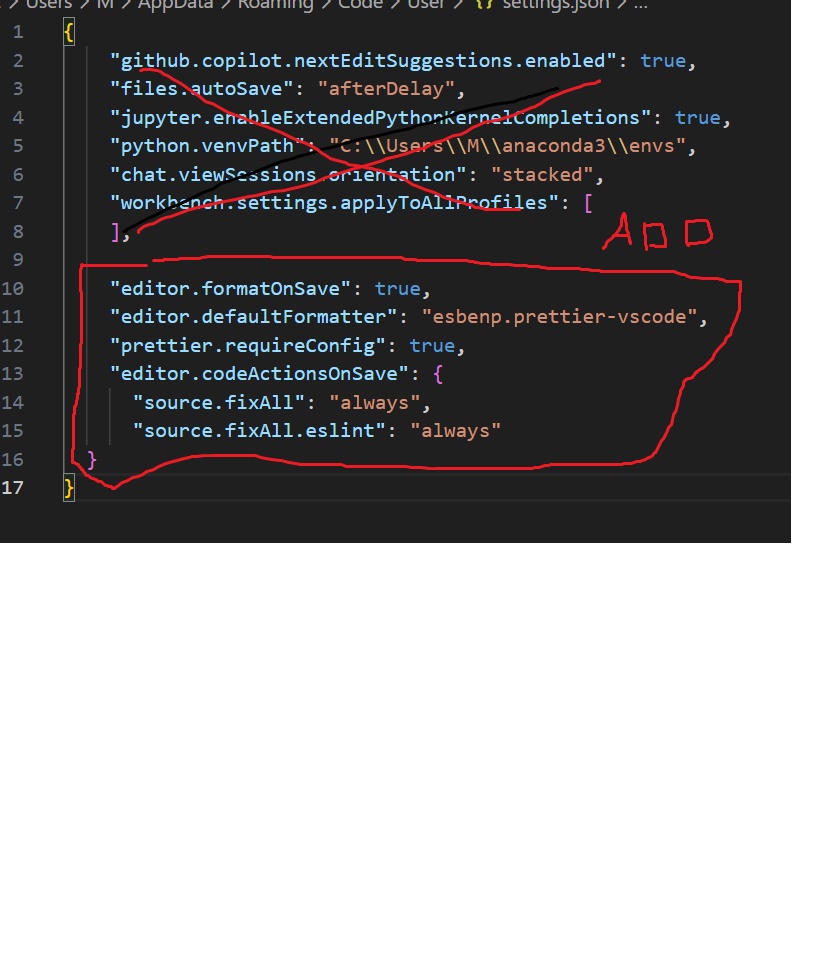

# To setup follow




```json
"editor.formatOnSave": true,
    "editor.defaultFormatter": "esbenp.prettier-vscode",
    "prettier.requireConfig": true,
    "editor.codeActionsOnSave": {
      "source.fixAll": "always",
      "source.fixAll.eslint": "always"
  }
```
